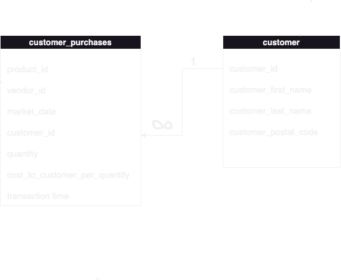

# Assignment 1: Meet the farmersmarket.db and Basic SQL

🚨 **Please review our [Assignment Submission Guide](https://github.com/UofT-DSI/onboarding/blob/main/onboarding_documents/submissions.md)** 🚨 for detailed instructions on how to format, branch, and submit your work. Following these guidelines is crucial for your submissions to be evaluated correctly.

#### Submission Parameters:
* Submission Due Date: `December 15, 2024`
* Weight: 30% of total grade
* The branch name for your repo should be: `assignment-one`
* What to submit for this assignment:
    * One Entity-Relationship Diagram (preferably in a pdf, jpeg, png format).
    * One .sql file 
* What the pull request link should look like for this assignment: `https://github.com/<your_github_username>/sql/pulls/<pr_id>`
    * Open a private window in your browser. Copy and paste the link to your pull request into the address bar. Make sure you can see your pull request properly. This helps the technical facilitator and learning support staff review your submission easily.

Checklist:
- [ ] Create a branch called `assignment-one`.
- [ ] Ensure that the repository is public.
- [ ] Review [the PR description guidelines](https://github.com/UofT-DSI/onboarding/blob/main/onboarding_documents/submissions.md#guidelines-for-pull-request-descriptions) and adhere to them.
- [ ] Verify that the link is accessible in a private browser window.

If you encounter any difficulties or have questions, please don't hesitate to reach out to our team via our Slack at `#cohort-5-help`. Our Technical Facilitators and Learning Support staff are here to help you navigate any challenges.

*** 

## Section 1:
You can start this section following *session 1*.

Steps to complete this part of the assignment:
- Load the farmersmarket.db and browse its content
- Create a logical data model

 
If this is your first time in DB Browser for SQLite, the following instructions may help:

#### 1) Load Database
- Open DB Browser for SQLite
- Go to File > Open Database
- Navigate to your farmersmarket.db 
	- This will be wherever you cloned the GH Repo (within the **SQL** folder)
	- 

#### 2) Configure your windows
By default, DB Browser for SQLite has three windows, with four tabs in the main window and three tabs in the bottom right window
- Window 1: Main Window (Centre)
	- Stay in the Database Structure tab for now
- Window 2: Edit Database Cell (Top Right)
- Window 3: Remote (Bottom Right)
	- Switch this to DB Schema tab (very bottom)

Your screen should look like this (or very similar)

#### 3) The farmersmarket.db
There are 10 tables in the Main Window:
1) booth
2) customer
3) customer_purchases
4) market_date_info
5) product
6) product_category
7) vendor
8) vendor_booth_assignments
9) vendor_inventory
10) zip_data

Switch to the Browse Data tab, booth is selected by default

Using the table drop down at the top left, explore some of the contents of the database

Move on to the Logical Data Model task when you have looked through the tables

### Build Logical Data Model

Recall during session 1:

I diagramed the following four tables:
- product
- product_category
- vendor
- vendor_inventory

 

#### Prompt 1:
Choose two tables and create a logical data model. There are lots of tools you can do this (including drawing this by hand), but I'd recommend [Draw.io](https://www.drawio.com/) or [LucidChart](https://www.lucidchart.com/pages/). 

A logical data model must contain:
- table name
- column names
- relationship type

Please do not pick the exact same tables that I have already diagrammed. For example, you shouldn't diagram the relationship between `product` and `product_category`, but you could diagram `product` and `customer_purchases`.

**HINTS**:
- You will need to use the Browse Data tab in the main window to figure out the relationship types.
- You can't diagram tables that don't share a common column
	- These are the tables that are connected
	- 
- The column names can be found in a few spots (DB Schema window in the bottom right, the Database Structure tab in the main window by expanding each table entry, at the top of the Browse Data tab in the main window)

***

## Section 2:
You can start this section following *session 2*.

Steps to complete this part of the assignment:
- Open the assignment1.sql file in DB Browser for SQLite:
	- from [Github](./02_activities/assignments/assignment1.sql)
	- or, from your local forked repository  
- Complete each question

### Write SQL

#### SELECT
1. Write a query that returns everything in the customer table.
2. Write a query that displays all of the columns and 10 rows from the customer table, sorted by customer_last_name, then customer_first_ name.

1.
SELECT *
FROM customer;

2.
SELECT *
FROM customer
ORDER BY	customer_last_name ASC
LIMIT 10;

SELECT *
FROM customer
ORDER BY	customer_first_name ASC
LIMIT 10

-

#### WHERE
1. Write a query that returns all customer purchases of product IDs 4 and 9.
2. Write a query that returns all customer purchases and a new calculated column 'price' (quantity * cost_to_customer_per_qty), filtered by vendor IDs between 8 and 10 (inclusive) using either:
	1.  two conditions using AND
	2.  one condition using BETWEEN

1.
SELECT *
FROM customer_purchases
WHERE product_id = 4 
OR product_id = 9

2.
SELECT vendor_id, quantity, cost_to_customer_per_qty, quantity*cost_to_customer_per_qty AS price
FROM customer_purchases
WHERE vendor_id BETWEEN 8 AND 10

-

#### CASE
1. Products can be sold by the individual unit or by bulk measures like lbs. or oz. Using the product table, write a query that outputs the `product_id` and `product_name` columns and add a column called `prod_qty_type_condensed` that displays the word “unit” if the `product_qty_type` is “unit,” and otherwise displays the word “bulk.”

2. We want to flag all of the different types of pepper products that are sold at the market. Add a column to the previous query called `pepper_flag` that outputs a 1 if the product_name contains the word “pepper” (regardless of capitalization), and otherwise outputs 0.

1.
SELECT *
,CASE WHEN product_qty_type = 'unit'
THEN 'unit'
ELSE 'bulk'
END as prod_qty_type_condensed
FROM product

2.
SELECT *
,CASE WHEN product_qty_type = 'unit'
THEN 'unit'
ELSE 'bulk'
END as prod_qty_type_condensed
,CASE WHEN product_name LIKE '%pepper%'
THEN 1
ELSE 0
END as pepper_flag
FROM product

-

#### JOIN
1. Write a query that `INNER JOIN`s the `vendor` table to the `vendor_booth_assignments` table on the `vendor_id` field they both have in common, and sorts the result by `vendor_name`, then `market_date`.

SELECT v.vendor_id, vendor_name, market_date
FROM vendor as v
INNER JOIN vendor_booth_assignments as vb
ON v.vendor_id = vb.vendor_id
ORDER BY vendor_name ASC

SELECT v.vendor_id, vendor_name, market_date
FROM vendor as v
INNER JOIN vendor_booth_assignments as vb
ON v.vendor_id = vb.vendor_id
ORDER BY market_date ASC

***

## Section 3:
You can start this section following *session 3*.

Steps to complete this part of the assignment:
- Open the assignment1.sql file in DB Browser for SQLite:
	- from [Github](./02_activities/assignments/assignment1.sql)
	- or, from your local forked repository  
- Complete each question

### Write SQL

#### AGGREGATE
1. Write a query that determines how many times each vendor has rented a booth at the farmer’s market by counting the vendor booth assignments per `vendor_id`.
2. The Farmer’s Market Customer Appreciation Committee wants to give a bumper sticker to everyone who has ever spent more than $2000 at the market. Write a query that generates a list of customers for them to give stickers to, sorted by last name, then first name.
   
**HINT**: This query requires you to join two tables, use an aggregate function, and use the HAVING keyword.

1.
SELECT vendor_id, COUNT (booth_number) AS 'total assignments per vendor_id'
FROM vendor_booth_assignments
GROUP BY vendor_id

2.
SELECT cp.customer_id, quantity*cost_to_customer_per_qty AS price, SUM(quantity*cost_to_customer_per_qty) AS total_spend, c.customer_first_name, c.customer_last_name
FROM customer_purchases AS cp
INNER JOIN customer AS c
ON c.customer_id = cp.customer_id
GROUP BY c.customer_id
HAVING total_spend>2000
ORDER BY customer_last_name 

SELECT cp.customer_id, quantity*cost_to_customer_per_qty AS price, SUM(quantity*cost_to_customer_per_qty) AS total_spend, c.customer_first_name, c.customer_last_name
FROM customer_purchases AS cp
INNER JOIN customer AS c
ON c.customer_id = cp.customer_id
GROUP BY c.customer_id
HAVING total_spend>2000
ORDER BY customer_first_name 

-

#### Temp Table
1. Insert the original vendor table into a temp.new_vendor and then add a 10th vendor: Thomass Superfood Store, a Fresh Focused store, owned by Thomas Rosenthal
   
**HINT**: This is two total queries -- first create the table from the original, then insert the new 10th vendor. When inserting the new vendor, you need to appropriately align the columns to be inserted (there are five columns to be inserted, I've given you the details, but not the syntax)

To insert the new row use VALUES, specifying the value you want for each column:  
`VALUES(col1,col2,col3,col4,col5)`

CREATE TEMP TABLE new_vendor AS
SELECT *
FROM vendor

SELECT *
FROM  new_vendor

INSERT INTO new_vendor (vendor_id, vendor_name, vendor_type, vendor_owner_first_name, vendor_owner_last_name)
SELECT '10', 'Thomass Superfoor Store', 'Fresh Focused', 'Thomas', 'Rosenthal'

-

#### Date
1. Get the customer_id, month, and year (in separate columns) of every purchase in the customer_purchases table.

SELECT customer_id
,strftime ('%m', market_date) AS Month
,strftime ('%Y', market_date) AS Year
FROM customer_purchases

   
**HINT**: you might need to search for strfrtime modifers sqlite on the web to know what the modifers for month and year are!

2. Using the previous query as a base, determine how much money each customer spent in April 2022. Remember that money spent is `quantity*cost_to_customer_per_qty`.

SELECT customer_id, market_date, SUM(quantity*cost_to_customer_per_qty) AS total_spend,
strftime ('%m', market_date) AS Month,
strftime ('%Y', market_date) AS Year
FROM customer_purchases
WHERE market_date BETWEEN '2022-04-01' AND '2022-04-30'
GROUP BY customer_id 

**HINTS**: you will need to AGGREGATE, GROUP BY, and filter...but remember, STRFTIME returns a STRING for your WHERE statement!!
